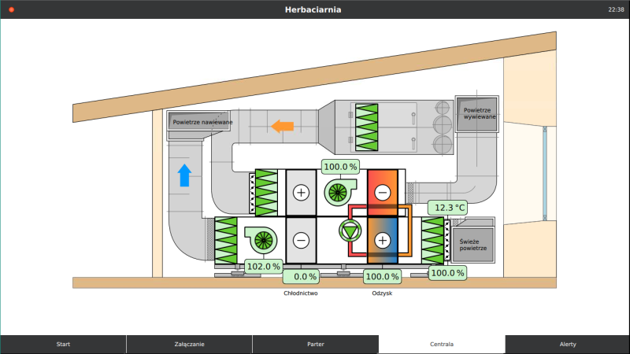
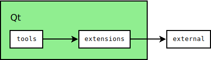

# CuteHMI

<!-- CUT HERE -->
<!-- TravisCI badge hack that kills Doxygen (1.8.14) warning "Unexpected html tag  found within <a href=...> context". -->
<div class="doxygen_github_hack" style="font-size: 0px">

[//]: # (\htmlonly)

[](https://opensource.org/licenses/LGPL-3.0)
[](https://opensource.org/licenses/MIT)
[](https://invent.kde.org/sdk/cutehmi/pipelines)
[](https://scan.coverity.com/projects/cutehmi)
[](https://www.codefactor.io/repository/github/michpolicht/cutehmi/overview/master)
[](https://webchat.kde.org/#/room/#cutehmi:kde.org)

[//]: # (\endhtmlonly)
</div>
<!-- CUT HERE -->

CuteHMI is an open-source HMI (Human Machine Interface) software written in C++
and QML, using Qt libraries as a framework.

CuteHMI is essentially a collection of libraries, plugins and executables,
referred to as "extensions" and "tools", glued together by Qbs components. To
create custom project one creates his own first-class extension, which may
depend on any number of other extensions and uses specific tool to load its
components. This makes CuteHMI very flexible framework with many use cases.




Note: While most of the project uses GNU Lesser General Public License version
3, some files are distributed under different licenses.

## Branches

Consecutive branch numbers denote successive iterations of the project.
Iteration of the project is related to build framework (repository layout and
Qbs items). Extensions and tools are versioned independently and they have their
own [development status](doc/development-statuses.md).

Branch "master" is a development branch. Development branch may contain source
code that is undergoing deep changes, rendering it unusable. Branch "master" is
merged frequently into a branch, which has "alpha" status. This branch may also
undergo deep modifications, but it should be usable. Branches with
"perpetual beta" status are stable in a sense that no backward incompatible
changes shall be made to them. For new projects it is recommended to use "alpha"
branch. By the time the project is finished branch should also stabilize.

<!-- CUT HERE -->
<!-- TravisCI badge hack that kills Doxygen (1.8.14) warning "Unexpected html tag  found within <a href=...> context". -->
<div class="doxygen_github_hack" style="font-size: 0px">

[//]: # (\htmlonly)

| Branch                                          | Build status                                                                                                                   | Development status |
|-------------------------------------------------|--------------------------------------------------------------------------------------------------------------------------------|--------------------|
| [master](https://invent.kde.org/sdk/cutehmi)    | [](https://invent.kde.org/sdk/cutehmi/pipelines) | pre-alpha          |
| [6](https://invent.kde.org/sdk/cutehmi/-/tree/6)| [](https://invent.kde.org/sdk/cutehmi/pipelines)      | alpha              |
| [5](https://invent.kde.org/sdk/cutehmi/-/tree/5)| [](https://invent.kde.org/sdk/cutehmi/pipelines)      | perpetual beta     |

[//]: # (\endhtmlonly)
</div>
<!-- CUT HERE -->


## Compiling

1. Get the Qt toolkit. Open-source and commercial editions can be obtained from
https://www.qt.io/. Qt can also be shipped with Linux distribution.

2. Open `CuteHMI.qbs` file with QtCreator and simply build it.

3. All extensions dependent on external libraries will be disabled, if these
libraries could not be found. To make the process of finding the libraries
and installing them under Windows easier, a set of Makefiles is provided, which
allows the libraries to be build from sources. Check out
[external](external/) libraries for more details. Each extension may
provide individual documentation on how to build it.

Remember that Qbs caches [Probe](http://doc.qt.io/qbs/qml-qbslanguageitems-probe.html)
items' results, so if the library is installed after the project has been
configured with Qbs, it will not show up. You can use `--force-probe-execution`
option to force Qbs to not use cached results.

### Building only specified products

By default Qbs will compile all the products (tools and extension), even if they
are not needed for a project. To build only specific product use
`--products | -p` [build option](https://doc.qt.io/qbs/cli-build.html#op-op-op-op-products-op-op-op-op-p-op-lt-op-name-op-gt-op-op-op-op-op-op-lt-op-name-op-gt-op-op-op-op-op-op-op-op-op).
For example following command will build only `CuteHMI.Examples.SimpleView.2`
extension and its dependencies, using default configuration.

```
qbs -f CuteHMI.qbs -p CuteHMI.Examples.SimpleView.2
```

Find out more about build options on
[Qbs documentation website](https://doc.qt.io/qbs/index.html).

## Getting started

For an introduction you may want to run one of the existing examples. In CuteHMI
everything is either a tool or an extension, therefore examples are also provided
as extensions. Their names start with "CuteHMI.Examples" prefix. The most basic
example `CuteHMI.Examples.SimpleView.2` can be run with `cutehmi.view.4` tool by
issuing following command.

```
cutehmi.view.4 CuteHMI.Examples.SimpleView.2
```

To create your own project you can simply copy one of the examples to your own
subdirectory in `extensions` directory (e.g. `Me/MyExtension.0`) and edit
`project.qbs` file. Change `name` property to match extension name (e.g. `name:
"Me.MyExtension.0"`)

After that you can use `--force-probe-execution` Qbs option or delete build
directory and rebuild whole project. Your extension should be installed and it
can be run with `cutehmi.view.4` tool.

```
cutehmi.view.4 Me.MyExtension.0
```

More methodical approach is to use one of the templates. The process of creating
custom extensions is described in more detail [here](extensions/).

Examples are listed in the documentation along with other extensions.


## Internals

Directory structure of the project is organized as follows.

- *_sass*, *_layouts* - directories used by GitHub Pages.
- *awkgward* - code maintanance scripts (don't bother).
- *dev* - development notes (irrelevant).
- [doc](doc/) - a place where documentation shall be.
- [extensions](extensions/) - libraries and QML extensions.
- [external](external/) - directory containing "external" libraries.
- *extra* - various stuff related to the project, such as T-shirts.
- *qbs* - Qbs modules and imports.
- [tools](tools/) - executable programs.



Two most important directories are [extensions](extensions/) and
[tools](tools/). Extensions combine functionality of QML extensions and
standard libraries. They can be utilized by end-user applications, but they can
be also linked with each other. Some extensions may depend on
[external](external/) libraries.

## Quick links

- [Repository](https://invent.kde.org/sdk/cutehmi)
- [Website](https://cutehmi.kde.org/)
- [Documentation](https://cutehmi.kde.org/docs/)

