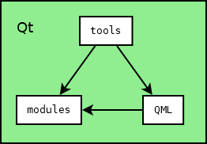

# CuteHMI

<!-- CUT HERE -->
<!-- TravisCI badge hack that kills Doxygen (1.8.14) warning "Unexpected html tag  found within <a href=...> context". -->
<div class="doxygen_github_hack" style="font-size: 0px">

[//]: # (\htmlonly)

[](https://opensource.org/licenses/MPL-2.0)
[](https://travis-ci.org/michpolicht/CuteHMI)

[//]: # (\endhtmlonly)
</div>
<!-- CUT HERE -->

CuteHMI is an open-source HMI (Human Machine Interface) software written in C++ and QML, using Qt libraries as a framework.

Note: While most of the project uses Mozilla Public License, v. 2.0, some files are distributed under different licenses.

## Compiling

1. Get the Qt toolkit. Open-source and commercial editions can be obtained from https://www.qt.io/. Qt can also be shipped with Linux distribution.

2. Modbus components still use libmodbus library (http://libmodbus.org/). On Linux one can run following commands.
```  
git clone git://github.com/stephane/libmodbus.git
cd libmodbus
git checkout f9358460ee1f62bcac716ad0444b3bbe7628b204
./autogen.sh
./configure
make && sudo make install
```  
Compiling libmodbus on Windows can be a bit more tricky. I won't write the instructions here, because if project prevails, it should use *QtSerialBus* module.

3. Open `CuteHMI.qbs` file with *QtCreator* and build it. When apllication starts it shows empty screen.

## Running example

To run *SampleProject* example with *QtCreator* click "Projects" -> "Build & Run" -> "Run" and in the "Command line arguments" box type: `--project="examples/SampleProject/SampleProject.cutehmi.xml"`.

If anything goes wrong during loading, first check debug output and verify that paths are correct.

Something similar to this should show up on screen.


## Internals

Directory structure of the project is organized as follows.

- *awkgward* - code maintanance scripts (don't bother).
- *dev* - development notes (irrelevant).
- *doc* - place where documentation shall be.
- *examples* - self-explanatory.
- *extra* - various stuff related to the project, such as T-shirts.
- [modules](modules/README.md) - the heart of the project.
- *qbs* - Qbs modules and imports.
- [QML](QML/README.md) - QML extensions (secondary heart of the project).
- [tools](tools/README.md) - end-user applications (tertiary heart of the project).



The concept is simple. Three most important directories are [modules](modules/README.md), [QML](QML/README.md) and [tools](tools/README.md). Modules are basically libraries, which provide various functionalities in modular fashion. These can be utilized by QML extensions or end-user applications. End-user applications may of course utilize QML extensions also, as this is one of the main features offered by Qt.

## Quick links

- [CuteHMI on GitHub](https://github.com/michpolicht/CuteHMI)
- [CuteHMI on GitHub Pages](http://michpolicht.github.io/CuteHMI/)
- [Documentation generated by Doxygen](https://michpolicht.github.io/CuteHMI_Doxygen/)

