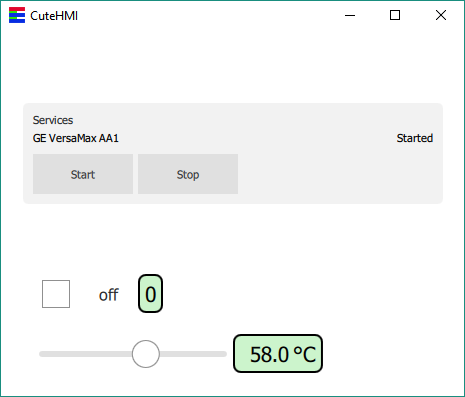
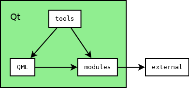

# CuteHMI

<!-- CUT HERE -->
<!-- TravisCI badge hack that kills Doxygen (1.8.14) warning "Unexpected html tag  found within <a href=...> context". -->
<div class="doxygen_github_hack" style="font-size: 0px">

[//]: # (\htmlonly)

[](https://opensource.org/licenses/MPL-2.0)
[](https://travis-ci.org/michpolicht/CuteHMI)

[//]: # (\endhtmlonly)
</div>
<!-- CUT HERE -->

CuteHMI is an open-source HMI (Human Machine Interface) software written in C++
and QML, using Qt libraries as a framework.

Note: While most of the project uses Mozilla Public License, v. 2.0, some files
are distributed under different licenses.

## Branches

Branch "master" is a development branch. Development branch may contain source code that is undergoing deep changes, rendering it unusable. Consecutive branch numbers denote successive iterations of the project.

<!-- CUT HERE -->
<!-- TravisCI badge hack that kills Doxygen (1.8.14) warning "Unexpected html tag  found within <a href=...> context". -->
<div class="doxygen_github_hack" style="font-size: 0px">

[//]: # (\htmlonly)

| Branch | Build status | Development status |
|--------|--------------|--------------------|
| [master](https://github.com/michpolicht/CuteHMI) | [](https://travis-ci.org/michpolicht/CuteHMI/branches) | pre-alpha |
| [1](https://github.com/michpolicht/CuteHMI/tree/1)      | [](https://travis-ci.org/michpolicht/CuteHMI/branches) | alpha |

[//]: # (\endhtmlonly)
</div>
<!-- CUT HERE -->

## Compiling

1. Get the Qt toolkit. Open-source and commercial editions can be obtained from
https://www.qt.io/. Qt can also be shipped with Linux distribution.

2. Open `CuteHMI.qbs` file with *QtCreator* and simply build it.

3. All modules dependent on external libraries will be disabled, if these
libraries could not be found. To make the process of finding the libraries
and installing them under Windows easier, a set of Makefiles is provided, which
allows the libraries to be build from sources. Check out 
[external](external/README.md) libraries for more details.

Under Linux one can run following commands to compile and install libmodbus
library.
```  
git clone git://github.com/stephane/libmodbus.git
cd libmodbus
git checkout f9358460ee1f62bcac716ad0444b3bbe7628b204
./autogen.sh
./configure
make && sudo make install
```

To install libssh on a Ubuntu-based system.
```
sudo apt-get -y install libssh-dev
```

On Arch-based system.
```
pacman -S libssh
```

To install PostgreSQL client library on Ubuntu-based system.
```
sudo apt-get -y install libpq-dev
```

Remember that Qbs caches [Probe](http://doc.qt.io/qbs/qml-qbslanguageitems-probe.html)
items' results, so if the library is installed after the project has been 
configured with Qbs, it will not show up. You can use `--force-probe-execution`
option to force Qbs to not use cached results.


## Running example

To run *SampleProject* example with *QtCreator* click 
"Projects" -> "Build & Run" -> "Run" and in the "Command line arguments" box 
type: `--project="examples/SampleProject/SampleProject.cutehmi.xml"`.

If anything goes wrong during loading, first check debug output and verify that
paths are correct.

Something similar to this should show up on screen.




## Internals

Directory structure of the project is organized as follows.

- *_sass*, *_layouts* - directories used by GitHub Pages.
- *awkgward* - code maintanance scripts (don't bother).
- *dev* - development notes (irrelevant).
- [doc](doc/README.md) - a place where documentation shall be.
- *examples* - self-explanatory.
- [extensions](external/README.md) - libraries and QML extensions.
- [external](external/README.md) - directory containing "external" libraries.
- *extra* - various stuff related to the project, such as T-shirts.
- [modules](modules/README.md) - to be replaced by extensions.
- *qbs* - Qbs modules and imports.
- [QML](QML/README.md) - to be replaced by extensions.
- [tools](tools/README.md) - end-user applications (secondary heart of the project).



Two most important directories are [extensions](extensions/README.md) and [tools](tools/README.md).
Extensions combine functionality of QML extensions and standard libraries. They can be utilized by end-user
applications, but they can be also linked with each other. Some extensions may depend on
[external](external/README.md) libraries.


## Quick links

- [CuteHMI on GitHub](https://github.com/michpolicht/CuteHMI)
- [CuteHMI on GitHub Pages](http://michpolicht.github.io/CuteHMI/)
- [Documentation generated by Doxygen](https://michpolicht.github.io/CuteHMI_Doxygen/docs/)

