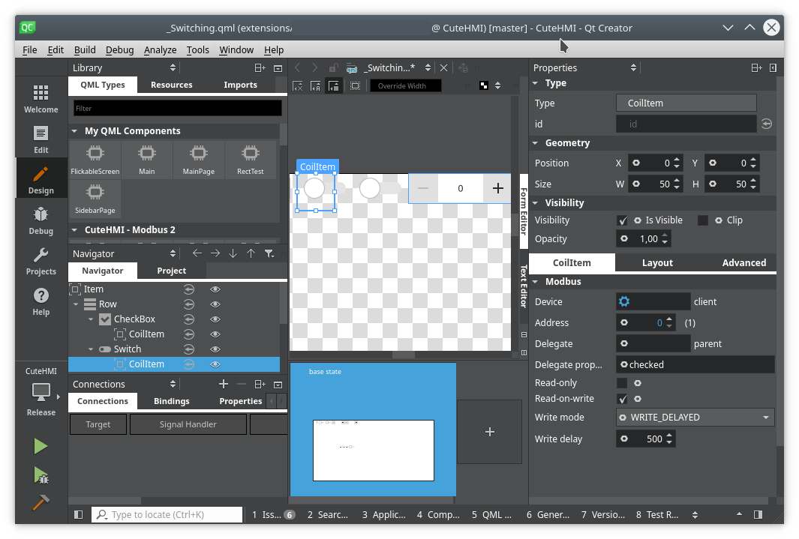
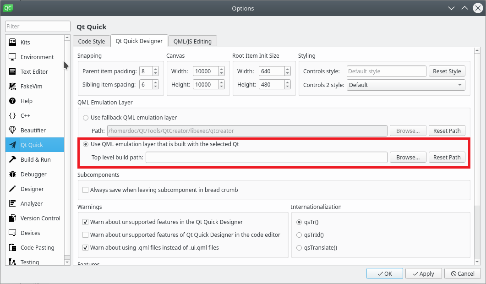

# Using Qt Creator in "Design" mode

Qt Creator is a great IDE, which can help you a lot when designing QML applications. In order to be able to use %CuteHMI components
in "Design" mode, in a similar fashion as on the screenshot below, you need to set up only few things.

First thing to acknowledge is that "Design" mode may not work with `Debug` build type. This is because Qt Creator underneath uses
release version of Qt libraries to render QML components. On Windows Qt Creator will give you an error message that you can not mix
debug and release version of libraries. So, to avoid troubles set build type to `Release`, when dealing with "Design" mode.

After that you need to build %CuteHMI, so that libraries and QML extensions are available. %CuteHMI build framework sets paths for
you, so there shouldn't be a need to set [qmlImportPaths property](https://doc.qt.io/qbs/porting-to-qbs.html#qml-import-path).

Next go to `Tools -> Options... -> Qt Quick`, then select `Qt Quick Designer` tab. In `QML Emulation Layer` group change `Use
fallback emulation layer` option to `Use QML emulation layer that is built with the selected Qt`.

You may need to restart Qt Creator to make it adjust to directories containing newly available QML extensions, which you have
successfully built.

After that you should be able to use QML components provided by %CuteHMI in "Design" mode. Generic documentation on how to use QML
extensions with Qt Creator is available
[here](https://doc.qt.io/qtcreator/creator-qml-modules-with-plugins.html#importing-qml-modules)

