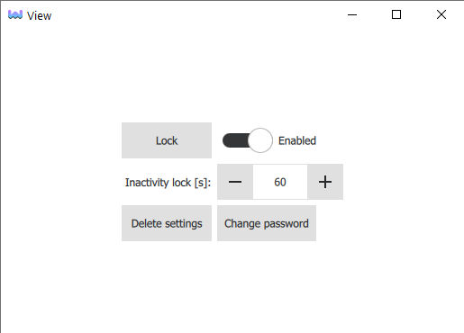
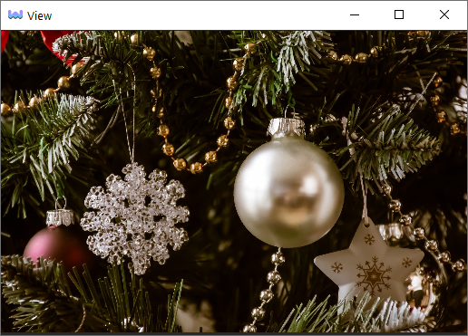

# Lock Screen Example

Example demonstrating how to use CuteHMI.LockScreen extension.





To run the example use [cutehmi.view.4](../../../../tools/cutehmi.view.4/) tool.
```
cutehmi.view.4 CuteHMI.Examples.LockScreen.2
```

\example View.qml
Here is a complete listing of the example source file.

\example CustomLockImage.qml
Here is a complete listing of the example source file.
