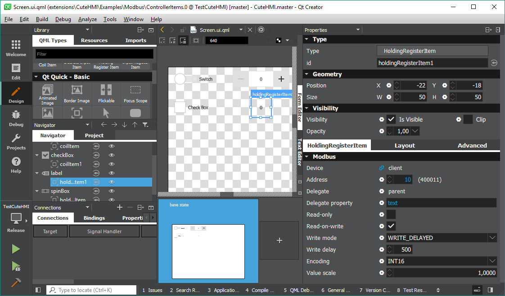

# Modbus Controller Items


The purpose of this example is to demonstrate the use of controller items, which are especially useful, when dealing with Qt Creator
"Design" mode.

Note: methods described here were written for Qt Creator 4.

Read a documentation on \ref using-qt-creator-in-design-mode.md "Using Qt Creator in Design mode" to see how to set up environment
for this example.

In this example component \ref Screen.ui.qml "Screen" is intended to be edited in "Design" mode. This should look similar to the
screenshot below.



As one can observe CuteHMI.Modbus.CoilItem and CuteHMI.Modbus.HoldingRegisterItem are created as child items of respective Qt
Quick controls, which they use as their delegates. Binding is established between controller and specified delegate property.

The example can be run with [cutehmi.view.4](../../../../../tools/cutehmi.view.4/) tool.
```
cutehmi.view.4 CuteHMI.Examples.Modbus.ControllerItems.3
```

## Development status

Due to constant changes and unstable development of QML Designer, CuteHMI extensions may no longer be properly loaded in
newer Qt Creator versions. Use of Qt 6 API may also affect (in the subtle ways) how extensions are being loaded by QML
Puppet. QML Designer is successively being replaced by Qt Design Studio. Because of that newer versions of Qt Creator are
no longer supported and methods described in this document may not work.

## Related pages

- [CHANGES](CHANGES.md)

\example View.qml
Here is a complete listing of the example source file.

\example Screen.ui.qml
Here is a complete listing of the example source file.
