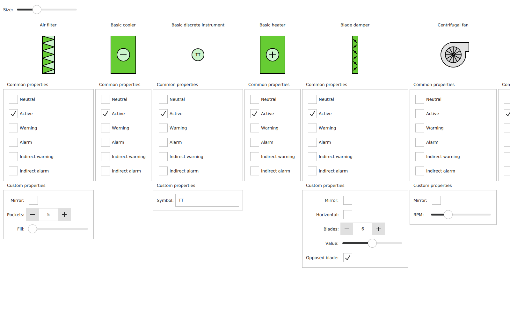

# HVAC Symbols Gallery Example

Gallery of HVAC symbols provided by [CuteHMI.Symbols.HVAC.1](../../../../Symbols/HVAC.1/) extension.



To run the example use [cutehmi.view.2](../../../../../../tools/cutehmi.view.2/) tool.
```
cutehmi.view.2 --extension="CuteHMI.Examples.Symbols.HVAC.Gallery.1"
```

\example AirFilterSettings.qml
Here is a complete listing of the example source file.

\example BasicDiscreteInstrumentSettings.qml
Here is a complete listing of the example source file.

\example CentrifugalFanSettings.qml
Here is a complete listing of the example source file.

\example ElementSettings.qml
Here is a complete listing of the example source file.

\example Main.qml
Here is a complete listing of the example source file.

\example MotorActuatorSettings.qml
Here is a complete listing of the example source file.

\example PumpSettings.qml
Here is a complete listing of the example source file.
