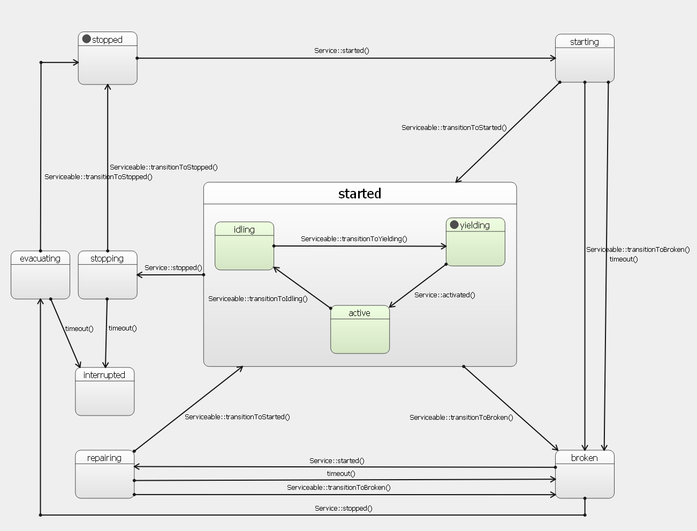

# Services

Extension that helps to create services. Many extensions may need to behave like services or daemons, doing their tasks in the
background, independently from UI. This extension helps to organize and coordinate them.

Services work on the basis of [The State Machine Framework](https://doc.qt.io/qt-6/qtstatemachine-cpp-guide.html). Each service is
controlled by its own state machine. This state machine is composed of some standard, predefined states commonly referred as
_state interface_. The details of actions performed in those state, as well as some of the transitions, are a subject of
cutehmi::services::Serviceable implementation.

# Major classes

Each object that wants to become a service either extends cutehmi::services::AbstractService or implements 
cutehmi::services::Serviceable interface. In order to turn object that implements cutehmi::services::Serviceable interface into a 
service one has to embed it inside cutehmi::services::Service object.

Class cutehmi::services::SelfService can be used to define the service in QML without the need of using C++ API. 

Class cutehmi::services::ServiceGroup can be used to conveniently manage a group of services.

Service operations can be managed by controllers (descendants of cutehmi::services::AbstractServiceController) and group rules
(descendants of cutehmi::services::ServiceGroupRule).

## Changes

### Version 3

- ServiceManager has been replaced with cutehmi::services::ServiceGroup and classes derived from
  cutehmi::services::AbstractServiceController or cutehmi::services::ServiceGroupRule can be used to control service operations.
- cutehmi::services::SelfService can be used to define QML services without the need of using C++ API.
- cutehmi::services::StateInterface provides clean access to service states.
- cutehmi::services::Serviceable has been slightly modified and state interface allows for reconfiguration of the state machine.
- PollingTimer has been removed.
