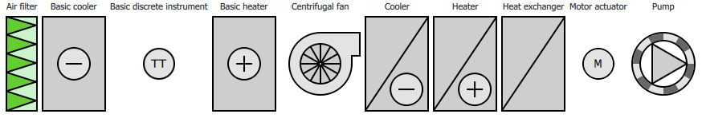

# HVAC Symbols

Collection of \ref active-symbols.md "active symbols" used in HVAC(R) industry.

Symbols are represented by various QML components provided by this extension. They can be previewed by running
[CuteHMI.Examples.Symbols.HVAC.Gallery.0](../../Examples/Symbols/HVAC/Gallery.0/) example.
