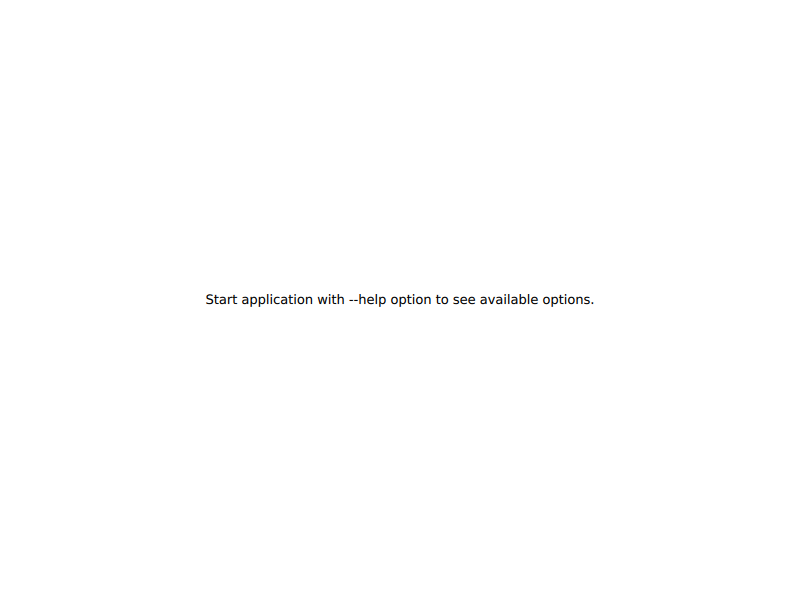
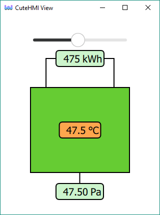

# View

**Obsolete** - this tool is being replaced by [cutehmi.view.3](../cutehmi.view.3/).

Client, GUI application, which allows one to run CuteHMI project in a window.

By default this tool shows only a simple help screen.



CuteHMI approach is to treat each project as a first-class QML extension, so the purpose of the tool is to load specified extension
and display one of its QML components. Any extension that provides graphical UI QML component can be loaded as *cutehmi.view.2*
project. Use `--extension` command line argument to specify an extension.

For example to run [Simple View](../../extensions/CuteHMI/Examples/SimpleView.0/) example use following command.
```
cutehmi.view.2 --extension="CuteHMI.Examples.SimpleView.0"
```

To run project from QtCreator click `Projects` -> `Run`. Select `cutehmi.view.2` from `Run configuration`. In the
`Command line arguments` box type: `cutehmi.view.2 --extension="CuteHMI.Examples.SimpleView.0"`.
The window should look similar to the screenshot below.



Default loader picks `Main.qml` as default QML component to load. Component can be specified with `--component` option. One can also
use `--init` option to replace default loader with custom one.

You can use `--help` command line argument to see a list of all possible command line options.

For debug builds use `cutehmi.view.2.debug` instead of `cutehmi.view.2`.
